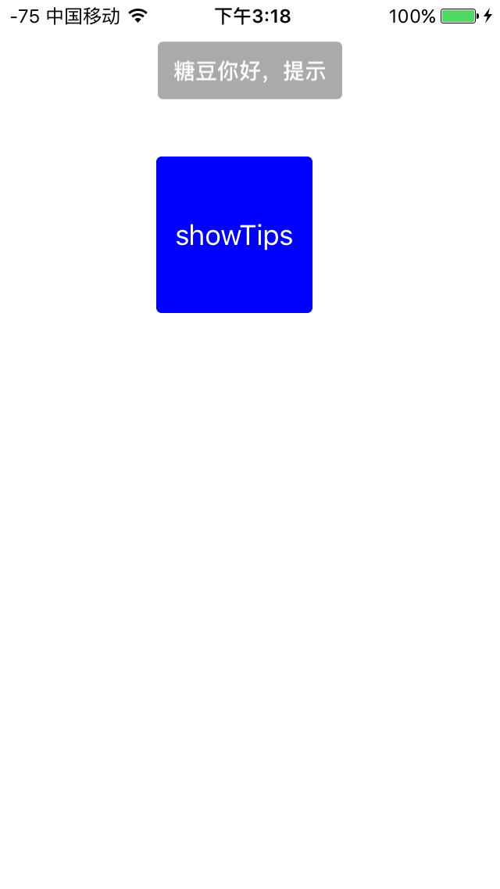
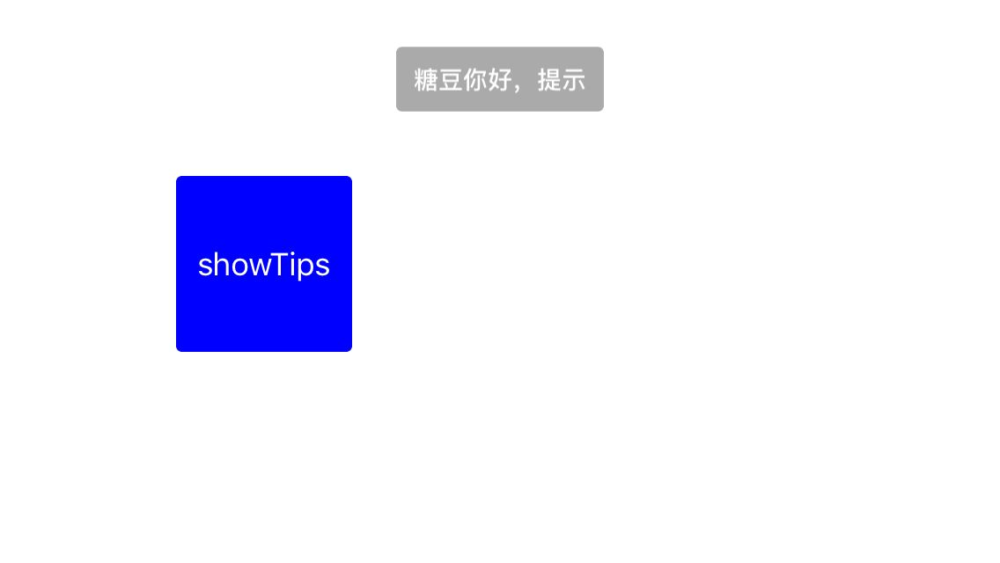
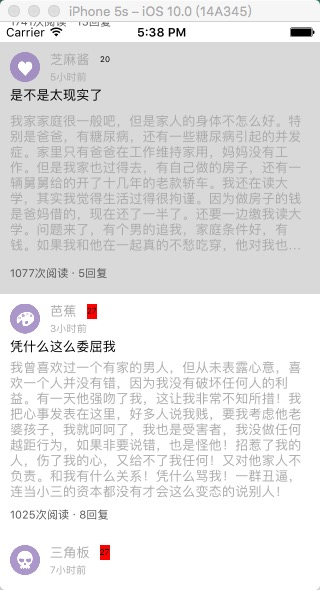
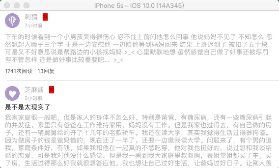

# SmallFunction

###fuction1：提示框--》TTips
------
简介：

  简单提示框，支持横竖屏提示，提示后，自动关闭。ios8版本以下也支持，ios8版本之上也支持
  
######调用方法：
 * 1、将文件"TTips.h" 和 "TTips.m" 拷贝到文件中。然后import "TTips.h"

 * 2、使用类方法：
 
 ```
 
   [TTips showMessages:@"糖豆你好，提示" duration:3000];
   

```

 
  
 * 效果
    * 竖屏
    
  
    * 横屏
    
    
    
    
###fuction2：UITableViewCell中的cell自适应高度--》MassonryB
----

######简介
 *  使用Mssonry使UITableViewCell的cell高度自适应；
 *  YYModel解析JSON生成model；
 *  SDWebImage中的"UIImageView+WebCache.h"解析图片；

  
######实现方法：
 * 1、将Json转为Model。

```
 
  for (int i = 0; i<list.count ; i++) {
        NSDictionary *dic = [list objectAtIndex:i];
        Model *data = [Model yy_modelWithJSON:dic];
        [self.dataArray addObject:data];
    }

```

 * 2、加载数据源：
  
```
 
  - (UITableViewCell *)tableView:(UITableView *)tableView cellForRowAtIndexPath:(NSIndexPath *)indexPath{
    TableViewCell *cell = [tableView dequeueReusableCellWithIdentifier:@"cell"];
    if (cell == nil) {
        cell = [[TableViewCell alloc] initWithStyle:UITableViewCellStyleSubtitle reuseIdentifier:@"cell"];
    }
    [cell loadData:[self.dataArray objectAtIndex:indexPath.row]];
  <b style="color:red">  [cell layoutIfNeeded];</b>
    return cell;
}

```

  其中这句需要写， <b style="color:red">  [cell layoutIfNeeded];</b>这句在横竖屏切换的时候会用到。
     
 * 3、给cell行加个估计的值
 
 ```
 
- (CGFloat)tableView:(UITableView *)tableView heightForRowAtIndexPath:(NSIndexPath *)indexPath{
    return UITableViewAutomaticDimension;
}

- (CGFloat)tableView:(UITableView *)tableView estimatedHeightForRowAtIndexPath:(NSIndexPath *)indexPath
{
    return 20;
}

```
 
 * 效果
 
    * 竖屏
    
    
  
    * 横屏
    
    
